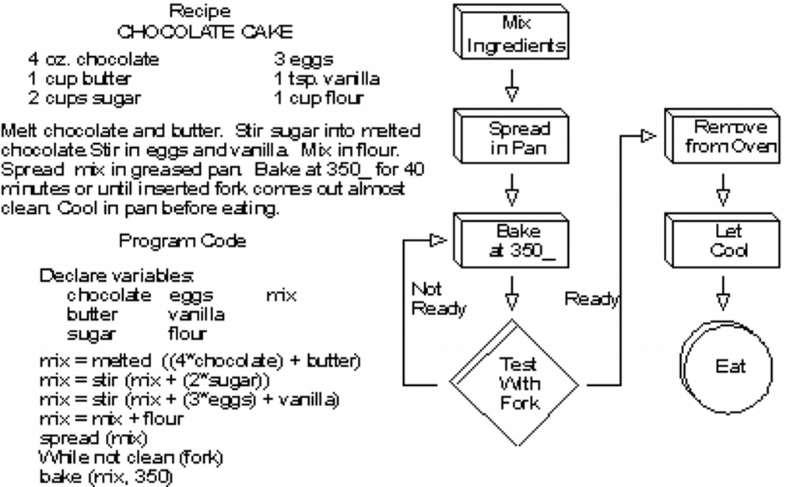
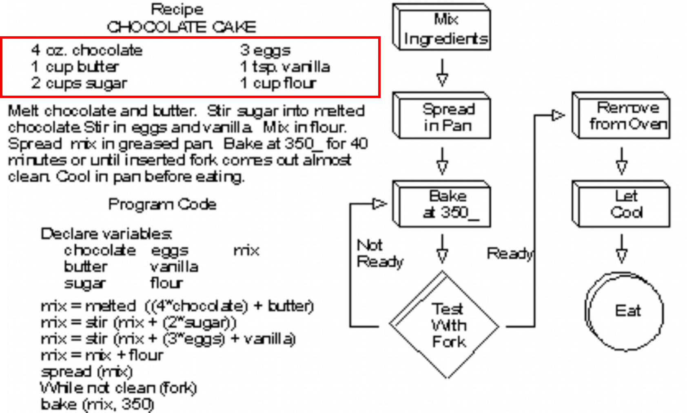
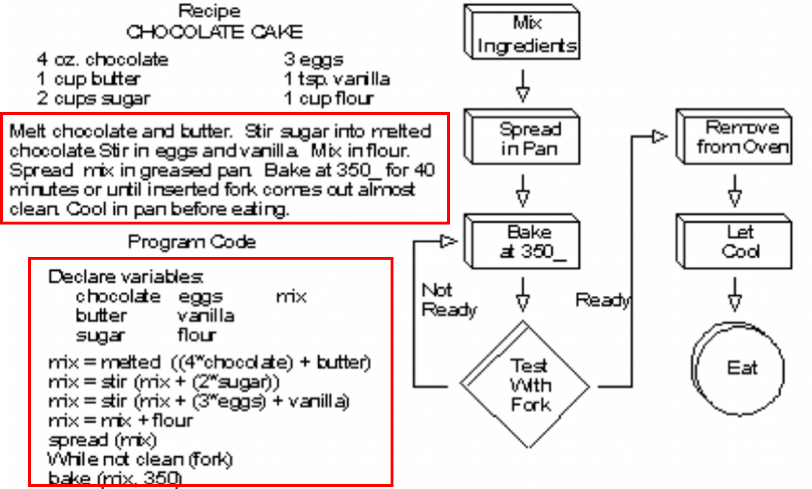
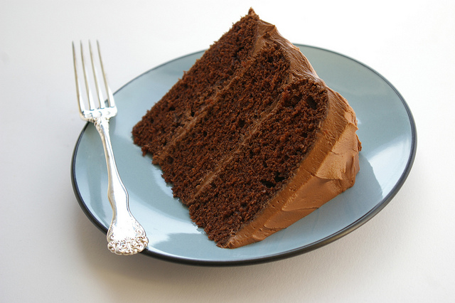

---

exclude:true
# Collect the Data
+ Key Skill: load data into R
+ File types: CSV, Excel, SQL database, API, etc.
+ R datasets package

???
+ Students will understand how to get data into R
+ This will be done by bullet points about the process

---

exclude:true
class:center,middle
# Data Exploration

## > [Download Exercise](code/faithful_a.R)

???
+ This is the start of exercise 2 in summarizing available data

---

exclude:true
# Do This
+ Open the dataset
+ Understand the data structure
+ Calculate summary statistics
+ Plot the data

???
+ Instructions for the self-paced section with data

---
exclude: true
# dplyr

???
+ Walk through previous example and add in packages
+ teach dplyr by making it work with example

---
exclude: true
# ggplot2

???
+ repeat from above
---
exclude: true
# lubridate

???
+ repeat from above

---
exclude:true
class:center,middle
# Algorithms

---
exclude:true
# What is an Algorithm?
+ Step by step instructions for any task
+ Inputs = Ingredients
+ Operation = Baking Instructions
+ Output = Dessert
+ Each step in the operation must be clearly defined and work the same with any input

---
exclude:true
# [Example](https://www.linkedin.com/pulse/way-algorithm-claudia-perlich)

---
exclude:true
.red[# Inputs]

---
exclude:true
.red[# Operation]

---
exclude:true
class:middle
.red[# Output]

##### Credit: Flickr user [Patent and the Pantry](https://www.flickr.com/photos/26412869@N03/). Image used under a [Creative Commons BY-NC-ND 2.0 license](https://creativecommons.org/licenses/by-nc-nd/2.0/legalcode)

???
+ define algorithm as instructions for cake
+ Lecture with images

---
exclude:true
class:center,middle
# Data Verification

???
+ Start of new section and exercise

---

exclude:true
# The Analytical Process

--
???
+ Establish frame for the analytics process to be followed in class
+ Familiarize students with terminology (esp "data wrangling/data cleaning")
+ Demystify the process
+ Empower students to do analysis

